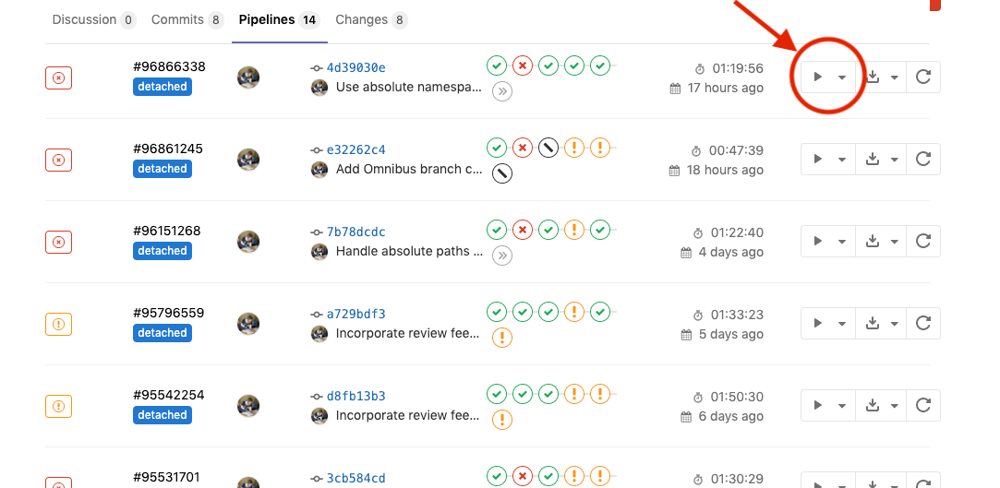
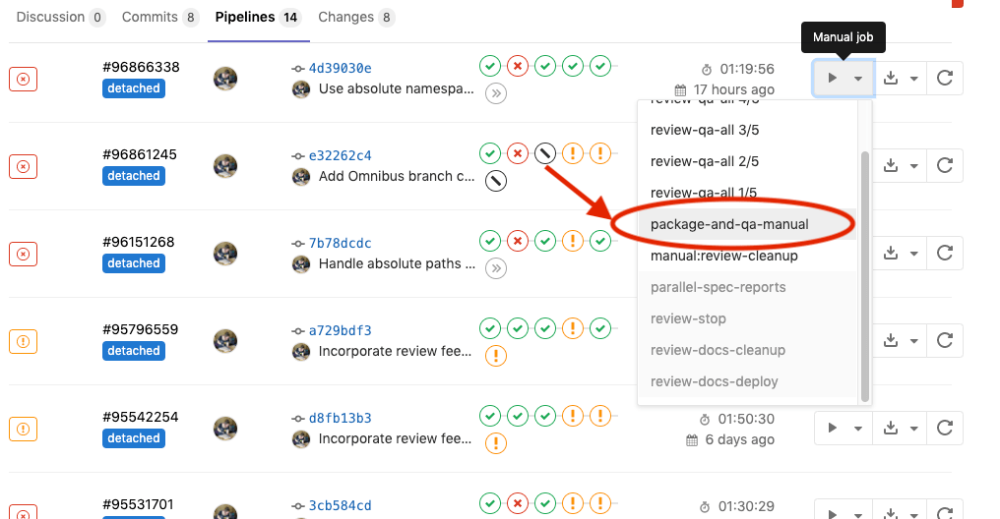

# Building a package for testing

While developing a new feature or modifying an existing one, it is helpful if an
installable package (or a Docker image) containing those changes is available
for testing. For this very purpose, a manual job is provided in the GitLab CI/CD
pipeline that can be used to trigger a pipeline in the Omnibus GitLab repository
that will create:

- A deb package for Ubuntu 16.04, available as a build artifact, and
- A Docker image, which is pushed to the
  [Omnibus GitLab container registry](https://gitlab.com/gitlab-org/omnibus-gitlab/container_registry)
  (images titled `gitlab-ce` and `gitlab-ee` respectively and image tag is the
  commit which triggered the pipeline).

When you push a commit to either the GitLab CE or GitLab EE project, the
pipeline for that commit will have a `build-package` manual action you can
trigger.

## Specifying versions of components

If you want to create a package from a specific branch, commit or tag of any of
the GitLab components (like GitLab Workhorse, Gitaly, or GitLab Pages), you
can specify the branch name, commit SHA or tag in the component's respective
`*_VERSION` file. For example, if you want to build a package that uses the
branch `0-1-stable`, modify the content of `GITALY_SERVER_VERSION` to
`0-1-stable` and push the commit. This will create a manual job that can be
used to trigger the build.

## Specifying the branch in Omnibus GitLab repository

In scenarios where a configuration change is to be introduced and Omnibus GitLab
repository already has the necessary changes in a specific branch, you can build
a package against that branch through a CI/CD variable named
`OMNIBUS_BRANCH`. To do this, specify that variable with the name of
the branch as value in `.gitlab-ci.yml` and push a commit. This will create a
manual job that can be used to trigger the build.
