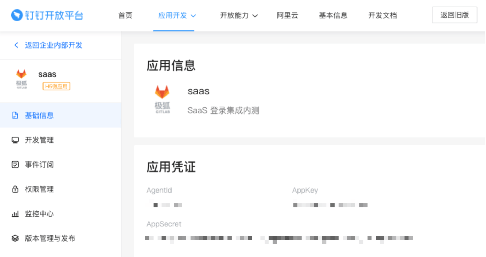

# DingTalk OAuth 2.0 OmniAuth provider **(FREE SELF)**

> [Introduced](https://gitlab.com/gitlab-org/gitlab/-/issues/341898) in GitLab 14.5.

You can sign in to GitLab using your DingTalk account.
Sign in to DingTalk Open Platform and create an application on it. DingTalk generates a client ID and secret key for you to use.

1. Sign in to [DingTalk Open Platform](https://open-dev.dingtalk.com/).

1. On the top bar, select **Application development > Enterprise internal development** and then select **Create Application**.

   

1. Fill in the application details:

   - **Application Name**: This can be anything. Consider something like `<Organization>'s GitLab`, or `<Your Name>'s GitLab`, or something else descriptive.
   - **Application Description**: Create a description.
   - **Application icon**: Upload qualified icons if needed.

   

1. Select **Confirm and create**.

1. On the left sidebar, select **DingTalk Application** and find your application. Select it and go to the application information page.

   

1. Under the **Application Credentials** section, there should be an AppKey and AppSecret (see the screenshot). Keep this page open as you continue the configuration.

   

1. On your GitLab server, open the configuration file.

   For Omnibus package:

   ```shell
   sudo editor /etc/gitlab/gitlab.rb
   ```

   For installations from source:

   ```shell
   cd /home/git/gitlab

   sudo -u git -H editor config/gitlab.yml
   ```

1. See [Configure initial settings](omniauth.md#configure-initial-settings) for initial settings.

1. Add the provider configuration:

   For Omnibus package:

   ```ruby
     gitlab_rails['omniauth_providers'] = [
       {
         name: "dingtalk",
         # label: "Provider name", # optional label for login button, defaults to "Ding Talk"
         app_id: "YOUR_APP_ID",
         app_secret: "YOUR_APP_SECRET"
       }
     ]
   ```

   For installations from source:

   ```yaml
   - { name: 'dingtalk',
       # label: 'Provider name', # optional label for login button, defaults to "Ding Talk"
       app_id: 'YOUR_APP_ID',
       app_secret: 'YOUR_APP_SECRET' }
   ```

1. Change `YOUR_APP_ID` to the AppKey from the application information page in step 6.

1. Change `YOUR_APP_SECRET` to the AppSecret from the application information page in step 6.

1. Save the configuration file.

1. For the changes to take effect:
   - If you installed via Omnibus, [reconfigure GitLab](../administration/restart_gitlab.md#omnibus-gitlab-reconfigure).
   - If you installed from source, [restart GitLab](../administration/restart_gitlab.md#installations-from-source).
