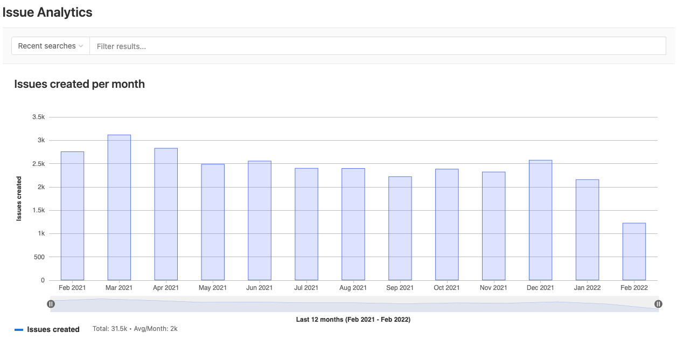
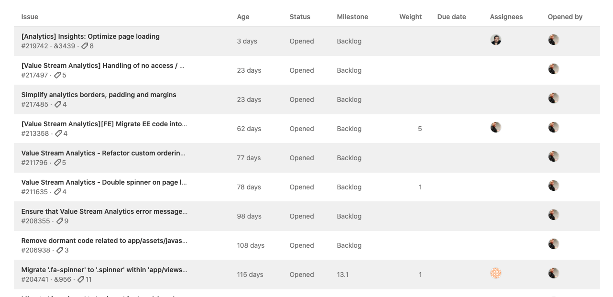

# Issue analytics for projects **(PREMIUM)**

> [Introduced](https://gitlab.com/gitlab-org/gitlab/-/issues/196561) in GitLab 12.9.

Issue analytics is a bar graph which illustrates the number of issues created each month.
The default time span is 13 months, which includes the current month, and the 12 months
prior.

To access the chart:

1. On the top bar, select **Main menu > Projects** and find your project.
1. On the left sidebar, select **Analytics > Issue**.

Hover over each bar to see the total number of issues.

To narrow the scope of issues included in the graph, enter your criteria in the
**Search or filter results...** field. Criteria from the following list can be typed in or selected from a menu:

- Author
- Assignee
- Milestone
- Label
- My reaction
- Weight

You can change the total number of months displayed by setting a URL parameter.
For example, `https://gitlab.com/groups/gitlab-org/-/issues_analytics?months_back=15`
shows a total of 15 months for the chart in the GitLab.org group.

## Drill into the information

> [Introduced](https://gitlab.com/gitlab-org/gitlab/-/issues/196547) in GitLab 13.1.

You can examine details of individual issues by browsing the table
located below the chart.

The chart displays the top 100 issues based on the global page filters.

