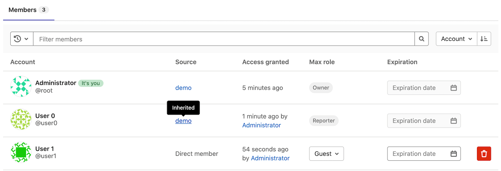
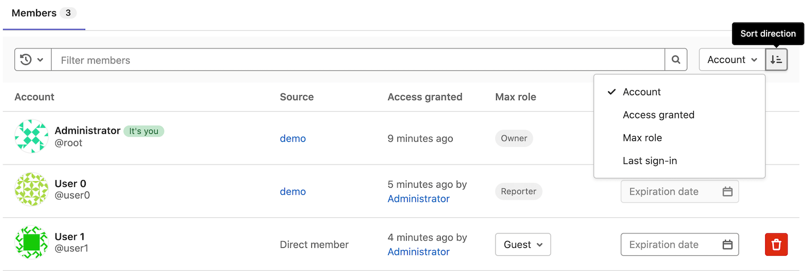

# Members of a project **(FREE)**

Members are the users and groups who have access to your project.

Each member gets a role, which determines what they can do in the project.

Project members can:

1. Be [direct members](#add-users-to-a-project) of the project.
1. [Inherit membership](#inherited-membership) of the project from the project's group.
1. Be a member of a group that was [shared](share_project_with_groups.md) with the project.
1. Be a member of a group that was [shared with the project's group](../../group/manage.md#share-a-group-with-another-group).

```mermaid
flowchart RL
  subgraph Group A
    A(Direct member)
    B{{Shared member}}
    subgraph Project A
      H(1. Direct member)
      C{{2. Inherited member}}
      D{{4. Inherited member}}
      E{{3. Shared member}}
    end
    A-->|Direct membership of Group A\nInherited membership of Project A|C
  end
  subgraph Group C
    G(Direct member)
  end
  subgraph Group B
    F(Direct member)
  end
  F-->|Group B\nshared with\nGroup A|B
  B-->|Inherited membership of Project A|D
  G-->|Group C shared with Project A|E
```

## Add users to a project

> - [Changed](https://gitlab.com/gitlab-org/gitlab/-/issues/247208) in GitLab 13.11 from a form to a modal window [with a flag](../../feature_flags.md). Disabled by default.
> - Modal window [enabled on GitLab.com and self-managed](https://gitlab.com/gitlab-org/gitlab/-/issues/247208) in GitLab 14.8.
> - [Generally available](https://gitlab.com/gitlab-org/gitlab/-/issues/352526) in GitLab 14.9.
    [Feature flag `invite_members_group_modal`](https://gitlab.com/gitlab-org/gitlab/-/issues/352526) removed.

Add users to a project so they become members and have permission
to perform actions.

The maximum role (access level) you set depends on if you have the Owner or Maintainer role for the group. For example, the maximum
role that can be set is:

- Owner (`50`), if you have the Owner role for the project.
- Maintainer (`40`), if you have the Maintainer role on the project.

In GitLab 14.8 and earlier, direct members of a project have a maximum role of Maintainer.
The Owner [role](../../permissions.md#project-members-permissions) can only be added at the group level.

Prerequisite:

- You must have the Maintainer or Owner role:
  - To remove direct members with the Maintainer role and below, you must have the Maintainer role.
  - To remove members with the Owner role, you must have the Owner role.

To add a user to a project:

1. On the top bar, select **Main menu > Projects** and find your project.
1. On the left sidebar, select **Project information > Members**.
1. Select **Invite members**.
1. Enter an email address and select a [role](../../permissions.md).
1. Optional. Select an **Access expiration date**.
   On that date, the user can no longer access the project.
1. Select **Invite**.

If the user has a GitLab account, they are added to the members list.
If you used an email address, the user receives an email.

If the invitation is not accepted, GitLab sends reminder emails two,
five, and ten days later. Unaccepted invites are automatically
deleted after 90 days.

If the user does not have a GitLab account, they are prompted to create an account
using the email address the invitation was sent to.

## Add groups to a project

> - [Changed](https://gitlab.com/gitlab-org/gitlab/-/issues/247208) in GitLab 13.11 from a form to a modal window [with a flag](../../feature_flags.md). Disabled by default.
> - Modal window [enabled on GitLab.com and self-managed](https://gitlab.com/gitlab-org/gitlab/-/issues/247208) in GitLab 14.8.
> - [Generally available](https://gitlab.com/gitlab-org/gitlab/-/issues/352526) in GitLab 14.9.
    [Feature flag `invite_members_group_modal`](https://gitlab.com/gitlab-org/gitlab/-/issues/352526) removed.

When you add a group to a project, each user in the group gets access to the project.
Each user's access is based on:

- The role they're assigned in the group.
- The maximum role you choose when you invite the group.

Prerequisite:

- You must have the Maintainer or Owner role.
- Sharing the project with other groups must not be [prevented](../../group/access_and_permissions.md#prevent-a-project-from-being-shared-with-groups).

To add groups to a project:

1. On the top bar, select **Main menu > Projects** and find your project.
1. On the left sidebar, select **Project information > Members**.
1. Select **Invite a group**.
1. Select a group.
1. Select the highest [role](../../permissions.md) for users in the group.
1. Optional. Select an **Access expiration date**. On that date, the group can no longer access the project.
1. Select **Invite**.

The members of the group are not displayed on the **Members** tab.
The **Members** tab shows:

- Members who are directly assigned to the project.
- If the project was created in a group [namespace](../../namespace/index.md), members of that group.

## Import users from another project

You can import another project's users to your own project. Users
retain the same permissions as the project you import them from.

Prerequisite:

- You must have the Maintainer or Owner role.

To import users:

1. On the top bar, select **Main menu > Projects** and find your project.
1. On the left sidebar, select **Project information > Members**.
1. Select **Import from a project**.
1. Select the project. You can view only the projects for which you're a maintainer.
1. Select **Import project members**.

After the success message displays, refresh the page to view the new members.

## Inherited membership

When your project belongs to a group, group members inherit their role
from the group.

In this example:

- Three members have access to the project.
- **User 0** is a Reporter and has inherited their role from the **demo** group,
  which contains the project.
- **User 1** belongs directly to the project. In the **Source** column, they are listed
  as a **Direct member**.
- **Administrator** is the [Owner](../../permissions.md) and member of all groups.
  They have inherited their role from the **demo** group.

If a user is a:

- Direct member of a project, the **Expiration** and **Max role** fields can be updated directly on the project.
- Inherited member from a parent group, the **Expiration** and **Max role** fields must be updated on the parent group.

## Remove a member from a project

If a user is a direct member of a project, you can remove them.
If membership is inherited from a parent group, then the member can be removed only from the parent
group itself.

Prerequisites:

- You must have the Maintainer or Owner role.
- Optional. Unassign the member from all issues and merge requests that
  are assigned to them.

To remove a member from a project:

1. On the top bar, select **Main menu > Projects** and find your project.
1. On the left sidebar, select **Project information > Members**.
1. Next to the project member you want to remove, select **Remove member**.
1. Optional. In the confirmation box, select the
   **Also unassign this user from related issues and merge requests** checkbox.
1. To prevent leaks of sensitive information from private projects, verify the
   user has not forked the private repository or created webhooks. Existing forks continue to receive
   changes from the upstream project, and webhooks continue to receive updates. You may also want to configure your project
   to prevent projects in a group
   [from being forked outside their group](../../group/access_and_permissions.md#prevent-project-forking-outside-group).
1. Select **Remove member**.

## Filter and sort members

> - [Introduced](https://gitlab.com/gitlab-org/gitlab/-/issues/21727) in GitLab 12.6.
> - [Improved](https://gitlab.com/groups/gitlab-org/-/epics/4901) in GitLab 13.9.
> - [Feature flag removed](https://gitlab.com/gitlab-org/gitlab/-/issues/299954) in GitLab 13.10.

You can filter and sort members in a project.

### Display inherited members

1. On the top bar, select **Main menu > Projects** and find your project.
1. On the left sidebar, select **Project information > Members**.
1. In the **Filter members** box, select `Membership` `=` `Inherited`.
1. Press <kbd>Enter</kbd>.

### Display direct members

1. On the top bar, select **Main menu > Projects** and find your project.
1. On the left sidebar, select **Project information > Members**.
1. In the **Filter members** box, select `Membership` `=` `Direct`.
1. Press <kbd>Enter</kbd>.

### Search

You can search for members by name, username, or email.

### Sort

You can sort members by **Account**, **Access granted**, **Max role**, or **Last sign-in** in ascending or descending order.

## Request access to a project

GitLab users can request to become a member of a project.

1. On the top bar, select **Main menu > Projects** and find the project you want to be a member of.
1. By the project name, select **Request Access**.

An email is sent to the most recently active project maintainers.
Up to ten project maintainers are notified.
Any project owner or maintainer can approve or decline the request.
Project maintainers cannot approve Owner role access requests.

If a project does not have any direct owners or maintainers, the notification is sent to the
most recently active owners of the project's group.

If you change your mind before your request is approved, select
**Withdraw Access Request**.

## Prevent users from requesting access to a project

You can prevent users from requesting access to a project.

Prerequisite:

- You must be the project owner.

1. On the top bar, select **Main menu > Projects** and find your project.
1. On the left sidebar, select **Settings > General**.
1. Expand **Visibility, project features, permissions**.
1. Under **Project visibility**, select **Users can request access**.
1. Select **Save changes**.

## Share a project with a group

Instead of adding users one by one, you can [share a project with an entire group](share_project_with_groups.md).
