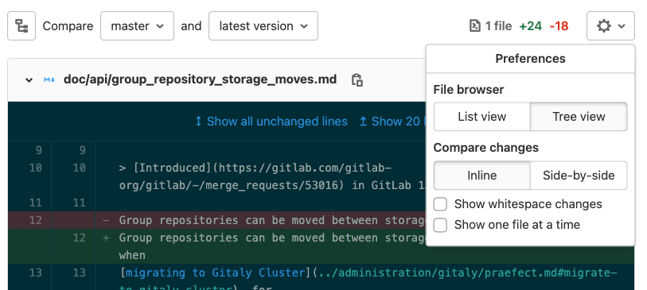
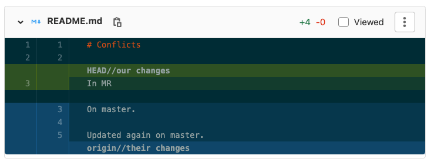

# Changes in merge requests **(FREE)**

A [merge request](index.md) proposes a set of changes to files in a branch in your repository. These
changes are shown as a _diff_ (difference) between the current state and the proposed
changes.

By default, the diff view compares the versions of files in the merge request source branch
to the files in the target branch, and shows only the parts of a file that have changed.

## Show all changes in a merge request

To view the diff of changes included in a merge request:

1. Go to your merge request.
1. Below the merge request title, select **Changes**.
1. If the merge request changes many files, you can jump directly to a specific file:
   1. Select **Show file browser** (**{file-tree}**) to display the file tree.
   1. Select the file you want to view.
   1. To hide the file browser, select **Show file browser** again.

In [GitLab 13.4](https://gitlab.com/gitlab-org/gitlab/-/issues/232820) and later, files
with many changes are collapsed to improve performance. GitLab displays the message:
**Some changes are not shown**. To view the changes for that file, select **Expand file**.

## Show one file at a time

> - [Introduced](https://gitlab.com/gitlab-org/gitlab/-/issues/222790) in GitLab 13.2.
> - [Feature flag removed](https://gitlab.com/gitlab-org/gitlab/-/issues/229848) in GitLab 13.7.

For larger merge requests, you can review one file at a time. You can change this setting
[temporarily in a merge request](#in-a-merge-request-show-only-one-file-at-a-time), or
so it [applies to all merge requests](#in-all-merge-requests-show-only-one-file-at-a-time).

### In a merge request, show only one file at a time

> [Introduced](https://gitlab.com/gitlab-org/gitlab/-/issues/233898) in GitLab 13.7.

To temporarily change your viewing preferences for a specific merge request:

1. Go to your merge request, and below the merge request title, select **Changes**.
1. Select **Preferences** (**{settings}**).
1. Select or clear the **Show one file at a time** checkbox.

This change overrides your choice in your user preferences. It persists until you
clear your browser's cookies or change this behavior again.

### In all merge requests, show only one file at a time

To view one file at a time for all of your merge requests:

1. In the top-right corner, select your avatar.
1. Select **Preferences**.
1. Scroll to the **Behavior** section and select the **Show one file at a time on merge request's Changes tab** checkbox.
1. Select **Save changes**.

After you enable this setting, GitLab displays only one file at a time when you review
merge requests. To view other changed files, either:

- Scroll to the end of the file and select either **Prev** or **Next**.
- Select **Show file browser** (**{file-tree}**) and select another file to view.

## Compare changes inline

You can view the changes inline:

1. Go to your merge request, and below the title, select **Changes**.
1. Select **Preferences** (**{settings}**).
1. In the **Compare changes** area, select **Inline**.

The changes are displayed after the original text.

## Compare changes side-by-side

Depending on the length of the changes in your merge request, you may find it
easier to view the changes inline, or side-by-side:

1. Go to your merge request, and below the title, select **Changes**.
1. Select **Preferences** (**{settings}**).
1. In the **Compare changes** area, select **Side-by-side**.

The changes are displayed across from one another.

## Expand or collapse comments

When reviewing code changes, you can hide inline comments:

1. Go to your merge request, and below the title, select **Changes**.
1. Scroll to the file that contains the comments you want to hide.
1. Scroll to the line the comment is attached to, and select **Collapse** (**{collapse}**):
   

To expand inline comments and show them again:

1. Go to your merge request, and below the title, select **Changes**.
1. Scroll to the file that contains the collapsed comments you want to show.
1. Scroll to the line the comment is attached to, and select the user avatar:
   

## Ignore whitespace changes

Whitespace changes can make it more difficult to see the substantive changes in
a merge request. You can choose to hide or show whitespace changes:

1. Go to your merge request, and below the title, select **Changes**.
1. Before the list of changed files, select **Preferences** (**{settings}**).
1. Select or clear the **Show whitespace changes** checkbox:

   

## Mark files as viewed

> - [Introduced](https://gitlab.com/gitlab-org/gitlab/-/merge_requests/51513) in GitLab 13.9 [with a flag](../../../administration/feature_flags.md) named `local_file_reviews`. Enabled by default.
> - [Feature flag removed](https://gitlab.com/gitlab-org/gitlab/-/issues/296674) in GitLab 14.3.

When reviewing a merge request with many files multiple times, you can ignore files
you've already reviewed. To hide files that haven't changed since your last review:

1. Go to your merge request, and below the title, select **Changes**.
1. In the file's header, select the **Viewed** checkbox.

Files marked as viewed are not shown to you again unless either:

- New changes are made to its content.
- You clear the **Viewed** checkbox.

## Show merge request conflicts in diff **(FREE SELF)**

> [Introduced](https://gitlab.com/gitlab-org/gitlab/-/issues/232484) in GitLab 13.5 [with a flag](../../../administration/feature_flags.md) named `display_merge_conflicts_in_diff`. Disabled by default.

FLAG:
On self-managed GitLab, by default this feature is not available. To make it available,
ask an administrator to [enable the feature flag](../../../administration/feature_flags.md)
named `display_merge_conflicts_in_diff`. On GitLab.com, this feature is not available.
The feature is not ready for production use.

To avoid displaying the changes that are already on target branch in the diff,
we compare the merge request's source branch with HEAD of the target branch.

When there are conflicts between the source and target branch, we show the
conflicts on the merge request diff:

